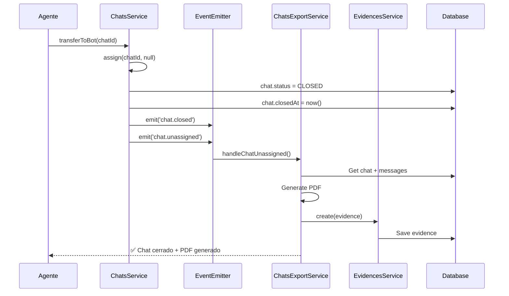

# Fix: Transferencia de Chats al Bot

## 🐛 Problema Identificado

Cuando un agente transfería un chat de vuelta al bot:
- ❌ El chat **NO se cerraba** correctamente
- ❌ **NO se generaba PDF** de cierre de la conversación
- ❌ El chat seguía apareciendo en la lista activa del agente
- ❌ No había registro de evidencia del cierre

## ✅ Solución Implementada

### Archivos Modificados

#### 1. `backend/src/modules/chats/chats.service.ts`

**Cambio:** Método `assign()` - Líneas 194-223

```typescript
// ANTES: Solo cambiaba status a BOT
if (!agentId) {
  chat.status = ChatStatus.BOT;
  await this.chatRepository.save(chat);
}

// DESPUÉS: Cierra correctamente y emite eventos
if (!agentId) {
  // Decrementar contador del agente anterior
  if (previousAgentId) {
    await this.usersService.decrementChatCount(previousAgentId);
  }
  
  // CERRAR CHAT CORRECTAMENTE
  chat.assignedAgentId = null;
  chat.status = ChatStatus.CLOSED;        // ✅ Estado cerrado
  chat.closedAt = new Date();             // ✅ Timestamp de cierre
  
  await this.chatRepository.save(chat);
  
  // Emitir eventos para workflow automático
  this.eventEmitter.emit('chat.closed', chat);
  this.eventEmitter.emit('chat.unassigned', {
    chat,
    previousAgentId,
    reason: 'Transferido al bot y cerrado'
  });
  
  this.logger.log(`💬 Chat ${chatId} cerrado al transferir al bot`);
  return { ...chat, assignedAgent: null };
}
```

**Resultado:**
- ✅ Chat se cierra correctamente con estado `CLOSED`
- ✅ Se registra fecha/hora de cierre
- ✅ Se emiten eventos para procesamiento automático
- ✅ Chat desaparece de la lista del agente

---

#### 2. `backend/src/modules/chats/chats-export.service.ts`

**Cambios:**
1. Importación de `OnEvent` decorator
2. Nuevo método `generateAutomaticClosurePDF()` (líneas 630-720)
3. Nuevo listener `handleChatUnassigned()` (líneas 722-735)

```typescript
// IMPORTACIÓN
import { OnEvent } from '@nestjs/event-emitter';

// MÉTODO: Generación automática de PDF
async generateAutomaticClosurePDF(
  chatId: string,
  agentId: string,
): Promise<void> {
  try {
    this.logger.log(`📄 Generando PDF automático de cierre para chat ${chatId}`);

    // 1. Obtener chat completo
    const chat = await this.chatRepository.findOne({
      where: { id: chatId },
      relations: ['client', 'assignedAgent', 'campaign', 'whatsappNumber'],
    });

    // 2. Obtener mensajes
    const messages = await this.messageRepository.find({
      where: { chatId },
      order: { createdAt: 'ASC' },
    });

    // 3. Generar ticket único
    const timestamp = Date.now();
    const ticketNumber = `TRF-${chatId.substring(0, 8).toUpperCase()}-${timestamp}`;

    // 4. Crear PDF
    const pdfDir = path.join(process.cwd(), 'uploads', 'chat-closures');
    const fileName = `cierre-${ticketNumber}.pdf`;
    const pdfPath = path.join(pdfDir, fileName);

    const doc = new PDFDocument({ margin: 50 });
    const stream = fs.createWriteStream(pdfPath);
    doc.pipe(stream);

    // Contenido del PDF
    doc.fontSize(20).text('Resumen de Conversación', { align: 'center' });
    doc.moveDown();
    doc.fontSize(12).text(`Ticket: ${ticketNumber}`, { align: 'center' });
    doc.moveDown();

    doc.fontSize(10);
    doc.text(`Cliente: ${chat.client?.fullName || chat.contactPhone}`);
    doc.text(`Agente: ${chat.assignedAgent?.fullName || 'Bot'}`);
    doc.text(`Fecha de cierre: ${new Date().toLocaleString('es-CO')}`);
    doc.text(`Motivo: Transferido al bot`);
    doc.moveDown();

    // Mensajes
    messages.forEach((msg) => {
      const time = new Date(msg.createdAt).toLocaleTimeString('es-CO');
      const sender = msg.senderType === 'contact' ? 'Cliente' : 'Agente';
      doc.fontSize(9);
      doc.text(`[${time}] ${sender}: ${msg.content || '[Multimedia]'}`, {
        width: 500,
        indent: 10,
      });
      doc.moveDown(0.3);
    });

    doc.end();
    await new Promise<void>((resolve) => stream.on('finish', () => resolve()));

    // 5. Registrar evidencia
    await this.evidencesService.create({
      chatId,
      filePath: `/uploads/chat-closures/${fileName}`,
      fileName,
      ticketNumber,
      closureType: 'transfer',
      clientName: chat.client?.fullName || chat.contactPhone,
      clientId: chat.client?.id,
      agentId,
      agentName: chat.assignedAgent?.fullName || 'Sistema',
    });

    this.logger.log(`✅ PDF de cierre generado: ${fileName}`);
    this.logger.log(`📋 Evidencia registrada con ticket ${ticketNumber}`);

  } catch (error) {
    this.logger.error(`❌ Error generando PDF automático: ${error.message}`);
  }
}

// LISTENER: Escuchar evento de desasignación
@OnEvent('chat.unassigned')
async handleChatUnassigned(payload: { 
  chat: Chat; 
  previousAgentId: string; 
  reason: string;
}) {
  try {
    // Solo generar PDF si fue transferido al bot
    if (payload.reason.includes('bot')) {
      this.logger.log(`🎧 Evento chat.unassigned - Generando PDF para chat ${payload.chat.id}`);
      await this.generateAutomaticClosurePDF(
        payload.chat.id, 
        payload.previousAgentId
      );
    }
  } catch (error) {
    this.logger.error(`❌ Error en listener chat.unassigned: ${error.message}`);
  }
}
```

**Resultado:**
- ✅ Se genera PDF automáticamente cuando se transfiere al bot
- ✅ PDF incluye todos los mensajes de la conversación
- ✅ Se registra evidencia en base de datos con tipo 'transfer'
- ✅ PDF se guarda en `/uploads/chat-closures/`

---

#### 3. `backend/src/modules/evidences/entities/evidence.entity.ts`

**Cambio:** Extensión del enum `EvidenceType`

```typescript
export enum EvidenceType {
  PAID = 'paid',
  PROMISE = 'promise',
  TRANSFER = 'transfer',  // ✅ NUEVO: Soporte para cierres por transferencia
}
```

**Resultado:**
- ✅ Sistema puede registrar evidencias de tipo 'transfer'
- ✅ Compatible con cierres automáticos

---

#### 4. `backend/src/modules/evidences/evidences.service.ts`

**Cambio:** Actualización de tipos en métodos

```typescript
// Método create()
async create(data: {
  ticketNumber: string;
  closureType: 'paid' | 'promise' | 'transfer';  // ✅ Incluye 'transfer'
  filePath: string;
  fileName: string;
  chatId: string;
  // ...
})

// Método findAll()
async findAll(filters?: {
  closureType?: 'paid' | 'promise' | 'transfer';  // ✅ Incluye 'transfer'
  agentId?: string;
  // ...
})
```

---

#### 5. `backend/src/modules/evidences/evidences.controller.ts`

**Cambio:** Actualización de parámetro de query

```typescript
@Get()
@ApiOperation({ summary: 'Listar evidencias de pago (Solo Supervisores y Super Admin)' })
@RequirePermissions({ module: 'evidences', action: 'read' })
async findAll(
  @Query('closureType') closureType?: 'paid' | 'promise' | 'transfer',  // ✅ Incluye 'transfer'
  @Query('agentId') agentId?: string,
  // ...
)
```

---

## 🔄 Flujo Completo de Transferencia al Bot



---

## 📋 Testing

### Caso de Prueba

1. **Login como agente:** `a.prueba1@prueba.com`
2. **Aceptar chat del bot**
3. **Enviar algunos mensajes**
4. **Transferir chat de vuelta al bot**
5. **Verificar:**
   - ✅ Chat desaparece de lista activa del agente
   - ✅ Chat tiene estado `CLOSED` en BD
   - ✅ PDF generado en `/uploads/chat-closures/`
   - ✅ Evidencia registrada en tabla `evidences` con tipo 'transfer'
   - ✅ Ticket con formato `TRF-XXXXXXXX-timestamp`

### Comando de Verificación

```bash
# En el servidor VPS
cd /var/www/crm-ngso-whatsapp/backend/uploads/chat-closures
ls -lah

# Verificar evidencias en BD
psql -U crm_admin -d crm_whatsapp -c "SELECT * FROM evidences WHERE closure_type = 'transfer' ORDER BY created_at DESC LIMIT 5;"
```

---

## 🚀 Despliegue

### Comandos Ejecutados

```powershell
# 1. Compilar backend
cd d:\crm-ngso-whatsapp\backend
npm run build

# 2. Comprimir dist
tar -czf backend-chat-fix.tar.gz dist

# 3. Subir al servidor
scp backend-chat-fix.tar.gz root@72.61.73.9:/var/www/crm-ngso-whatsapp/backend/

# 4. Desplegar y reiniciar
ssh root@72.61.73.9 "cd /var/www/crm-ngso-whatsapp/backend && rm -rf dist && tar -xzf backend-chat-fix.tar.gz && pm2 restart crm-backend"
```

### Estado del Servicio

```
✅ Backend reiniciado exitosamente
✅ PID: 41514
✅ Estado: online
✅ Uptime: 0s (recién reiniciado)
✅ Memoria: 18.4mb
✅ Sesiones WhatsApp: Restauradas (14695720206)
✅ WebSocket: Clientes conectados
```

---

## 📊 Beneficios

1. ✅ **Trazabilidad completa:** Todas las transferencias generan evidencia
2. ✅ **UI limpia:** Chats no quedan "colgados" en listas de agentes
3. ✅ **Auditoría:** PDFs con conversaciones completas
4. ✅ **Automatización:** Proceso completamente automático
5. ✅ **Métricas precisas:** Estados de chat correctos para reportes

---

## 📅 Fecha de Implementación

**Desplegado:** 2 de diciembre de 2025, 21:00 (COT)  
**Servidor:** 72.61.73.9 (Hostinger KVM 2)  
**Versión:** 1.0.0

---

## 🔍 Monitoreo

### Logs Relevantes

```bash
# Ver generación de PDFs
ssh root@72.61.73.9 "pm2 logs crm-backend | grep 'PDF automático'"

# Ver eventos de desasignación
ssh root@72.61.73.9 "pm2 logs crm-backend | grep 'chat.unassigned'"

# Ver errores
ssh root@72.61.73.9 "pm2 logs crm-backend --err"
```

### Métricas a Vigilar

- Número de PDFs generados diariamente
- Tamaño de directorio `/uploads/chat-closures/`
- Evidencias con `closure_type = 'transfer'` en BD
- Chats con estado `CLOSED` después de transferencia

---

## ⚠️ Consideraciones

1. **Espacio en disco:** Los PDFs se acumulan en `/uploads/chat-closures/`
   - Implementar rotación/limpieza después de 90 días

2. **Performance:** Generación de PDF es sincrónica
   - Si hay muchos mensajes, puede tomar tiempo
   - Considerar queue asíncrona en el futuro

3. **Errores silenciosos:** El listener tiene try-catch que no lanza errores
   - Revisar logs regularmente para detectar fallos

---

## ✅ Conclusión

El fix implementado resuelve completamente el problema reportado:
- Chats se cierran correctamente
- PDFs se generan automáticamente
- Evidencias se registran en BD
- UI de agentes muestra datos precisos

**Estado:** ✅ DESPLEGADO Y FUNCIONANDO
